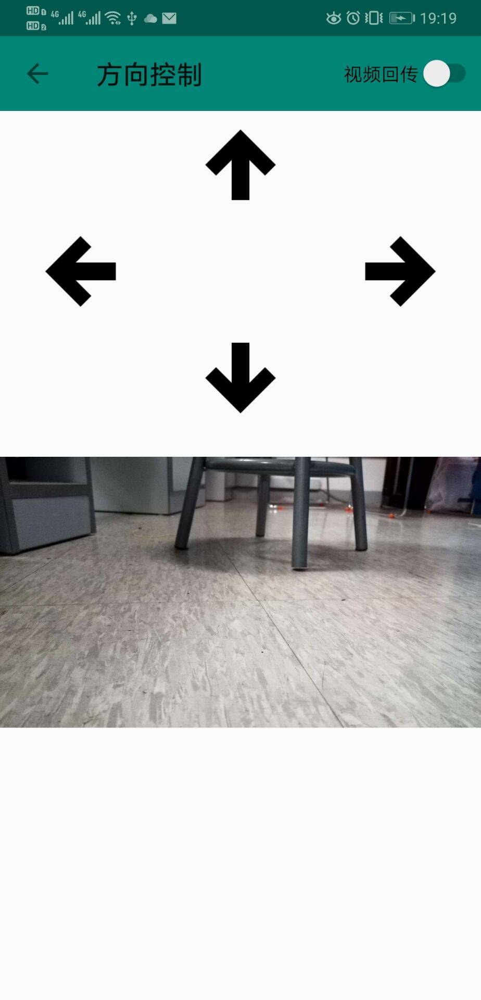

# 工程实践与科技创新 III-C 17 组项目报告

## 目录

[TOC]

## 项目信息

### 项目名称

基于手机的智能车系统

### 成员及分工

| 姓名     | 分工                                     |
| -------- | ---------------------------------------- |
| 王梓涵   | 车载端界面、网络通讯、图像回传           |
| 杜蔻年华 | 小车控制、硬件调试、蓝牙通讯             |
| 张博文   | 遥控端控制方式（方向键、手势、重力感应） |
| 李岩松   | 遥控端控制方式（手势、语音）             |

以下为小组成员合照：


左前-张博文，右前-杜蔻年华，左后-李岩松、右后-王梓涵

### 作品照片


## 项目介绍

### 整体结构

本项目由两部手机，一辆小车组成，一部手机为手持遥控端，另一台手机为车载端。遥控端通过各种操控方式向车载端发出控制指令，车载端通过蓝牙将指令转发到小车上，小车解码指令，控制电机转速以响应。车载端还可将其捕获的图像实时回传到遥控端上。

### 硬件部分

#### 模块连接

硬件系统包括三轮驱动、单片机 MSP430G2553、HC06 蓝牙模块、电池组等，单片机接口示意图如下图所示。系统供电情况：单片机供电电压为 3.3V，电机驱动供电电压为 5V，蓝牙模块可选择由单片机或电池直接供电，各模块之间共地。蓝牙组装时蓝牙模块 TXD 连接单片机 RXD 端，蓝牙模块 RXD 连接单片机 TXD 端。每一组电机通过两个针脚写入正转/反转速。


#### 小车控制

小车控制端代码开发环境为 Energia 1.8.7E21。小车可接受指令：“L”（左转）、“R”（右转）、“A”（前进）、“B”（后退）、“P”（停止）。代码关键部分解释如下：

1. 引脚定义，转速定义（注意不同电机之间的不平衡）；

2. `setup()` 定义：`Serial.begin(9600)`，定义管脚为输出模式，初始化为低电平；

3. `loop()`：代码主体，循环执行。通过 `Serial.read()` 捕捉蓝牙信息，根据内容调用相应动作函数。部分代码如下图，注意调试成功后需要删除 `Serial.println()` ，以防止蓝牙信息通讯一来一回导致延迟。

    ```c++
    incomingByte = Serial.read();
    if (incomingByte == 'L') {
        // Serial.println("TURN LEFT");
        turnLeft();
        Serial.read();
    } ...
    ```

4. 相应动作函数：其中 `stopBack()` 向所有电机后退的针脚写低电平值，通过向不同电机对应的针脚写入不同转速控制小车直行、左转及进行其他动作。

    ```c++
    void stopBack();
    void turnLeft();
    void turnRight();
    void goAhead();
    void park();
    void goBack();
    ```

### 软件部分

#### 用户界面

遥控端和车载端有各自的界面。遥控段主界面提供了 IP 地址的输入框、连接按钮，以及五种控制方式的按钮。车载端以当前捕获的画面作为背景，界面元素主要放置在左下角。第一行显示了最新的行驶命令以及是否使用自动驾驶的开关，第二行是网络和蓝牙的连接按钮，以及通过车载端让小车停下的应急按钮。剩余三行分别显示了该设备的 IP 地址及当前的网络连接状况。


#### 控制方式

##### 方向键控制

在布局中创建五个按钮对象，分别对应着前进，后退，左转，右转，停止。在 Activity 中为每个按钮设置 `onClick` 的响应函数。在按钮按下时给小车发送按钮对应的指令。



##### 重力感应

首先从系统服务中获取加速度传感器。以手机短边为 x 轴，长边为 y 轴，z 轴竖直向下。由于手机受到重力加速度，所以当手机平放的时候，只有 z 方向有加速度分量，当手机左右倾斜的时候，x 方向和 z 方向有加速度分量，当手机前后倾斜的时候，y 方向和 z 方向有加速度分量。按照这个规律，就可以通过手机的倾斜，去改变系统服务中加速度传感器各分量的值，从而控制小车的前进。方向确定的临界加速度值可以调整。


##### 手柄控制

借助 `com.jmedeisis.bugstick.Joystick` 库，我们可以创建一个可供拖动的手柄，可以创造出平时玩手机游戏操控汽车的感觉。我们 `Joystick` 对象重写一个 `onDrag()` 函数，在其中检测手柄被拖动的方向，根据给出的方向，去控制小车行驶的方向，获取方向的具体的临界角度值可以自行调整。


##### 手势控制

通过调用安卓 SDK 中的 `GestureDetector` 库，利用 `MotionEvent` 中 `getX` 和 `getY` 函数，检测触摸到屏幕和离开屏幕的相对位置来判断手势滑动方向以及距离来判断并发送相应的行进指令。并设置当滑动距离较小（`Flip_Distance` 的下限设置为 300）时，判为停止。


##### 语音控制

通过使用讯飞语音库识别讲话内容并利用 `parseVoice` 函数解析语音内容——前进、后退、左转、右转、停止，对小车发送相应指令。


#### 网络通信

双机之间的网络通信通过套接字来完成，只要遥控端和车载端连接到同一个 WLAN 上，即可通过套接字收发信息。在本系统中需要使用网络通信的有两个功能：指令收发和图像回传。其中指令是遥控段发送、车载端接受，而图像是车载端发送、遥控端接受。之所以指令要通过车载端转发，是因为原本设计中车载端可以实现自动驾驶，即车载端本身也需要发送指令。在本系统中，这两种数据是通过不同的端口传输的，端口号事先规定并作为常量写入到程序中，且规定接收方为主机、发送方为客机。在连接时只要发送方输入接收方的 IP 地址即可完成连接。

指令以字符的形式传输，指令发送程序实现生产者-消费者模型，其需要维护一个字符串队列以及一个守护线程。当遥控段通过某种方式发出控制指令时，指令字符串会先加入到队列中，若队列已满则丢弃。守护线程首先尝试连接车载端，若连接成功则持续从队列中取出指令发送，若连接失败或发送过程中出现异常则在一定延时后重新尝试连接。接收程序建立主机端口，不断尝试读取字符串，在接收到一个字符串后调用回调函数来完成转发，这样实现了网络通信和蓝牙通信的分离。

图像的传输和字符串整体流程类似。不同之处在于：图像队列中永远保存最近的帧，即加入新的图像时，如果队列已满，则将较早的帧先出队。图像在传输前进行压缩，并且将其长度编码成一个八字节长度的字符串作为头，先发送头再发送剩余图像。这样可以通过一次套接字连接传输连续多帧图像，且图像的体积也较小，提高了图像回传的效率。

#### 蓝牙通信

蓝牙的连接需要用户指定目标设备，所以需要一个界面供用户选择。在得到设备信息后，获取该设备的蓝牙套接字进行通信，其余步骤和网络套接字通信类似。由于蓝牙通信是在确保正确连接的基础上进行的，所以不需要实现生产者-消费者模型。蓝牙的发送通过提供给消息接收程序的回调函数实现，通过网络收到消息后立刻转发给蓝牙设备。

#### 图像处理

在完成基本功能之余，我们尝试了在车载端进行图像处理来实现自动驾驶。将小车放于黑线上，使其自行跟踪黑线并前进或转向。图像处理功能基于 OpenCV 的 Android 平台版本开发。在捕获一帧图像后，传送给自动驾驶程序。先对图像进行压缩，进行直方图均衡化以降低光照的影响。然后裁剪出感兴趣区，一般是图像中部靠下的一块区域，是车载端可见的路径部分。之后对图像进行二值化，将路径和非路径部分区分出来。将图像横向三等分，分别对三个区域计算掩膜部分占该区域面积之比，根据三个比例值的绝对大小和相对大小来决定小车方向。如果某一区域比值最小（路径面积占比最大）且绝对大小较小，则向该方向行驶；如果所有比值均较大，说明丢失目标，会尝试左转以寻找路径。

由于各种原因，我们并未来得及充分调试该功能，特别是调整其中的一些参数。目前在开启自动驾驶模式后，小车尚未能走完预定的线路，所以在验收中未能呈现出来。

## 运行结果

### 演示

<video src='video/demo.mp4' controls='controls'></iframe>


### 测试情况

* 五种控制模式（方向键、手势、重力感应、手势、语音）均能正常工作
* 小车能及时响应控制指令，运行流畅
* 图像回传速率高

## 总结

### 优点与不足

本项目具有以下优点：

* 系统运行稳定、流畅，响应及时；
* 控制方式多样；
* 软件结构设计合理，高度模块化，易于维护和扩展。

本项目尚有以下可改进的方面：

* 用户界面的布局可以更加规范一些；
* 已开发的自动寻路功能尚无法投入实际使用，需要结合小车的运行状况进行进一步调试。

### 个人感受

**王梓涵**  本次工科创的实践经历对我而言是有不少收获的。我负责的主要是网络和图像部分的功能。网络部分需要用到一些操作系统上学到的知识，比如套接字、多线程、生产者-消费者模型等，引导我利用专业知识解决现实问题。此次开发手机应用部分，我尝试了使用 Kotlin 这一更现代的编程语言，它不仅可以和现有的 Java 代码无缝交互，而且在各种方面都比 Java 更简洁和安全，这使我感受到了编程语言设计的改进对于软件开发的意义。由于软件需要分工开发，所以对软件模块化提出了要求。在编写程序的过程中，需要考虑如何尽可能把功能封装起来，以便和组员的程序整合，而不仅仅是在主活动里把功能做出来。略有遗憾的一点是，由于我们组在解决各种硬件问题上花了太多时间，我准备开发的自动驾驶功能只写出了程序，却来不及调试使其正常运行。我觉得主要是我们对硬件的了解不足，并且也缺乏和其它组的交流，导致了排查故障比较盲目、没有明确的思路，这也算是一点启示吧。最后还是感谢组员们的付出，你们每个人都对这个项目的完成作出了重要的贡献，希望你们不要介意我在这段时间里频繁地催锅。=￣ω￣=

**杜蔻年华**  本次工科创中，我主要负责硬件，小车代码和蓝牙通讯部分。工作中碰到了一系列问题。本次我们组领取的小车零件非常分散，小车支架也不完整，刚开始组装小车时，由于五转三模块的故障，系统供电一直有问题，后来通过直接引入电池 3V 正级线解决给单片机供电，舍弃了五转三模块；而后在使用单片机时，偶尔会出现经过一段时间使用后小车无法响应/接受指令的问题，系充电电池老化导致单片机供电不足所致，需要将 3V 电级线再增加一节电池解决，后来为了稳定供电，我们购买了非可充电电池；另一个困扰了很久的问题是蓝牙接受指令，小车响应指令时经常出现延迟，尤其在重力感应模块下，后来发现是因为在编写小车控制端代码时，为了调试方便，蓝牙每收到指令，还会返回一段信息提示收到的指令，而重力感应模块在设计时有大量指令输出，蓝牙频繁输入输出将导致延迟，故在调试成功后，需将小车控制中蓝牙输出反馈删掉，避免延迟。本次工科创中，碰到了一些之前没有预料过的问题，提高了分析解决问题的能力，电路的反复连接/排错也让我对单片机和系统电路有了更深刻的了解。此外，特别需要感谢队友们花大量时间共同调试，一起解决问题。

**张博文**  在本次工科创课程，我第一次尝试用 Android Studio 进行手机 App 的开发，了解到了自己每天都在使用的手机 App 最基本的开发流程。而我在平时经常会有一些突发奇想，想要自己开发一些 App 满足自己平时的一些需求，而这次经历，给我提供了一个非常好的铺垫，打下了基础。另外，这个课程十分考验同伴之间的协作能力。在开发一个软件的时候，多个人的代码存在着一些不兼容的地方，都需要协调沟通，培养了我在编程实践中的团队协作能力。最后在调试的过程也碰到了许多麻烦，在解决这些困难的时候也培养了解决问题的能力。

**李岩松**  在这次工科创课程中，我负责的是手机端语音识别和手势识别功能的实现以及小车的部分调试工作。经过一系列学习，完成安卓环境的搭建和应用App的编写。让我感触最深的是安卓环境下各种库的强大，这一点语音识别模块体现的尤为明显，通过调用科大讯飞的库，高效地实现了语音识别的功能。其次，与II-B不同的是，工科创III-C对于软硬件整体调试的要求更高，在具体落实时软件部分又可分为手机端和小车端。在最后整体调试的阶段，小组在手机发送指令和小车执行指令这一部分遇到了问题，花费了较多时间才得以检查出错误并解决。在未来的工程应用中，不仅要保证独立模块的正确性和可操作性，更要考虑整体，统一解决。

## 附录

### 系统使用说明

1. 启动小车电源，启动车载端应用，点击应用左下角的“Bluetooth”按钮，点击小车蓝牙模块对应的设备，将车载端与小车蓝牙模块连接；
2. 启动遥控端应用，在文本输入框内输入车载端的 IP 地址（显示在车载端应用的左下角），点击“连接”以建立指令传输的套接字连接；
3. 点击车载端应用左下部的“Socket”按钮，输入遥控端的 IP 地址（显示在遥控端应用的上部），点击“确认”以建立图像回传的套接字连接；
4. 通过车载端应用左下角的网络状态信息，确认指令传输和图像回传的连接均已正常，将车载端手机装到小车上；
5. 在遥控端界面上选择任一控制方式（包括方向键、手势、重力感应、手势、语音五种）对小车进行控制，小车回传图像均会显示在界面上；
6. 操作完毕后，关闭小车电源，遥控端和车载端各自关闭应用即可。

### 源代码

源代码见 [source](source) 目录，[car](source/car) 子目录下放置了小车单片机代码，[remote](source/remote) 子目录下放置了遥控端应用代码，[mounted](source/mounted) 子目录下放置了小车端应用代码。

### 系统电路图


### 参考资料

1. [工科创 3C 课程资料](https://eelab.sjtu.edu.cn/kc)